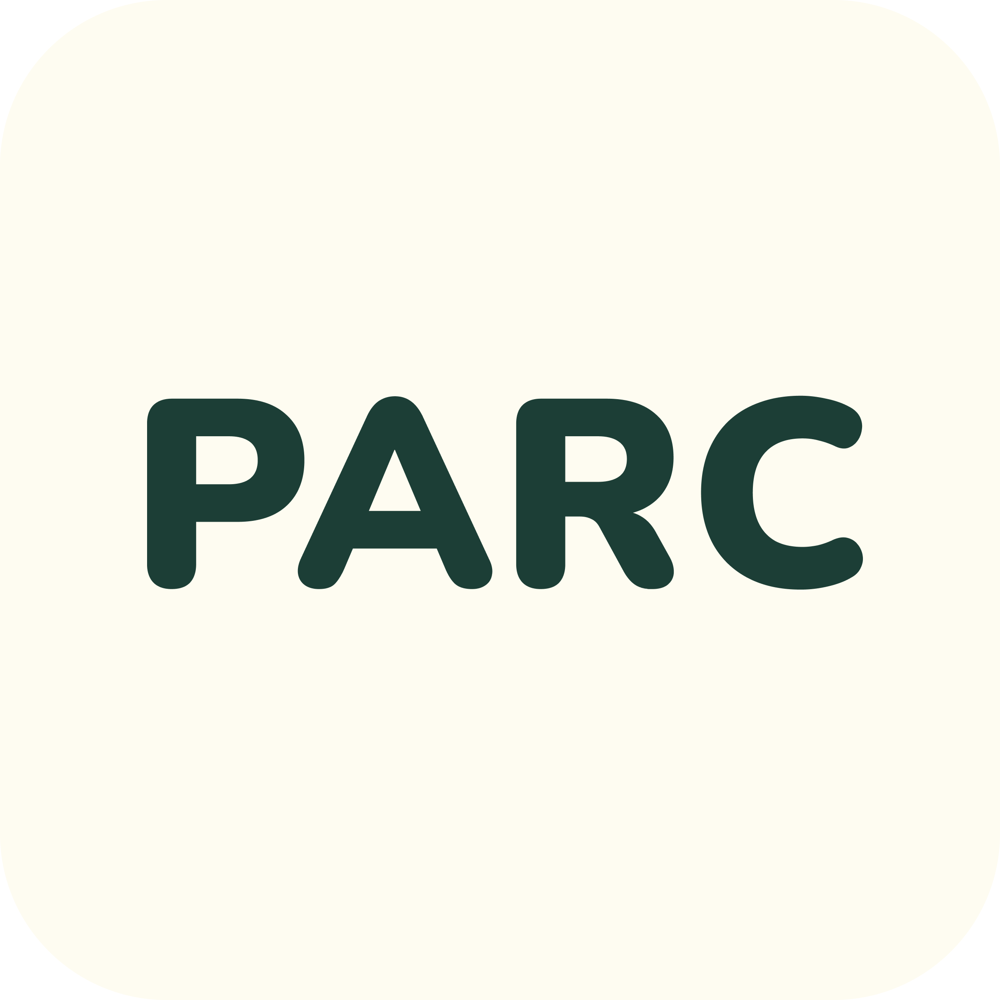

<h1 style="display: flex; flex-direction: column;">
    
     Parc
</h1>

Parc is an iOS application that allows Gen-Z consumers to invest in leading franchises like McDonald's and Subway with £100. This lowers the barrier to entry to an asset typically reserved for HNIs and let the 8.6 million Gen-Z investors in the UK, a seat on the table.

Users can browse different franchises available for investment, evaluate the data points, and chat with an AI-enabled franchise investing expert before deciding to invest. The performance of all investments can be viewed on the portfolio page, and liquidity has been factored through the secondary market.

## System Design

    

## User
### Landing Page

    

### Home

    

### AI-Enabled Chatbot

    

### Portfolio

    

### Secondary Market

    

## Admin

    

